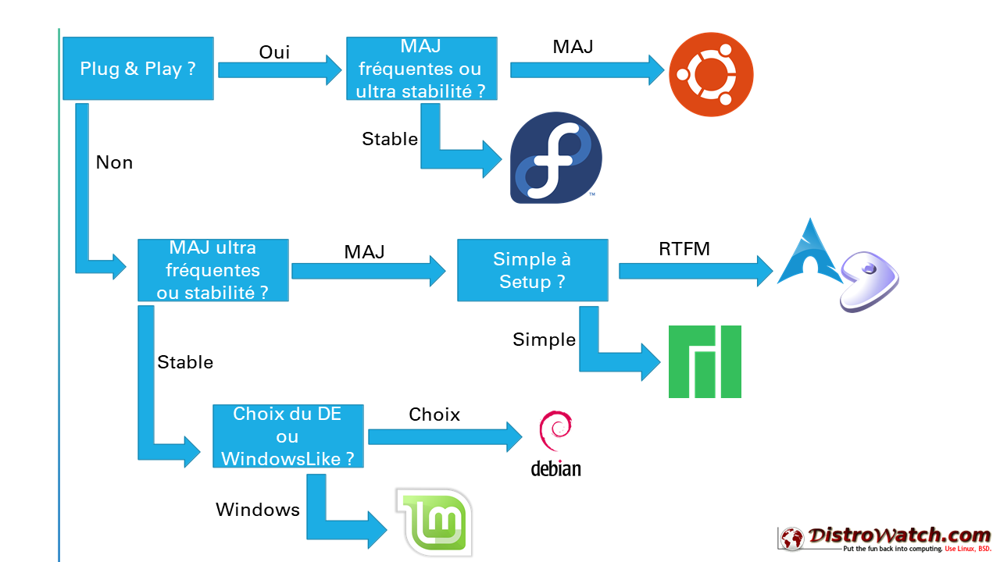

# Vue d'Epitech : Les meilleurs distro Linux

Durant mon parcours à Epitech, nous avons eu à tester plusieurs distro linux pour nos projets. 
C'est une expérience très enrichissante qui nous a permis de découvrir le hardware que nous utilisions chaque jour, et comprendre les rouages de l'informatique passé et moderne.

Voici donc selon moi le classement des top distro linux mainstream, pour une utilisation quotidienne
   

## Distro #1 : [Ubuntu][4]

Première sortie le **20 octobre 2004** 
Crée et maintenue par la société [**CANONICAL**][5]

Elle est désormais la distribution linux la plus connue au monde pour sa simplicité d'utilisation. Elle répondra alors à tous les besoins basiques d'un utilisateur lambda
 Deux versions disponibles : une normale mise à jour tous les 6 mois et une LTS tous les 2 ans

<table>
  <tr>
    <td><b>Les Plus</b></td>
    <td><b>Les Moins</b></td>
  </tr>
  <tr>
    <td>Simple d'utilisation</td>
    <td>Gestion du réseau capricieuse</td>
  </tr>
  <tr>
    <td>Complète pour tous les usages</td>
    <td>Envoi de données à Canonical activé par défaut</td>
  </tr>
  <tr>
    <td>Polyvalence</td>
    <td></td>
  </tr>
</table>

> ### [Télécharger Ubuntu][4]

##  Distro #2 : [Debian][7]

 Première sortie le **16 août 1993** 
Crée par [**Ian Murdock**][6]

Distro aujourd'hui mère de milliers d'autres distributions. 
Elle est la plus connue et utilisée dans le monde des serveurs par sa reconnaissance de stabilité et de performance.  
Je la conseille pour avoir plus la main que sous Ubuntu, en gardant la même base.

<table>
  <tr>
    <td><b>Les Plus</b></td>
    <td><b>Les Moins</b></td>
  </tr>
  <tr>
    <td>Simple d'utilisation</td>
    <td>Deux gestionnaires de paquets créant une confusion</td>
  </tr>
  <tr>
    <td>Légère et compacte</td>
    <td>Mauvaise gestion des drivers GPU Intel</td>
  </tr>
  <tr>
    <td>Stabilité accrue</td>
    <td>Pensée pour une utilisation Server et non Desktop</td>
  </tr>
  <tr>
    <td>Modulable</td>
    <td></td>
  </tr>
  <tr>
    <td>Setup complet et libre</td>
    <td></td>
  </tr>
</table>

> ### [Télécharger Debian][7]

##  Distro #3 : [Arch Linux][1]

 Première sortie en **Mars 2002** 
Crée par [**Judd Vinet**][8]

Distro connue pour sa complexité d'installation et sa tendance à l'autodestruction
 Elle est recommandée aux utilisateurs avancés de linux, car son installation n'a rien d'automatique, laissant l'utilisateur livré à lui-même et ses manuels. 
Elle est parfaite pour apprendre de fond en combles le fonctionnement de sa machine ainsi que de linux

<table>
  <tr>
    <td><b>Les Plus</b></td>
    <td><b>Les Moins</b></td>
  </tr>
  <tr>
    <td>Mises à jour instantanées</td>
    <td>Peu de sécurité</td>
  </tr>
  <tr>
    <td>Ultra Légère</td>
    <td>Complexité d'installation</td>
  </tr>
  <tr>
    <td>Gestionnaire de paquets performant pour la gestion de dépendances</td>
    <td>Mises à jour non testées</td>
  </tr>
  <tr>
    <td>Communauté énorme (AUR)</td>
    <td></td>
  </tr>
</table>

> ### [Télécharger Arch Linux][1]

##  Distro #4 : [Fedora][3]

 Première sortie en **2002** 
Crée par [**Red Hat**][2]

Distro fiable et complète, version desktop gratuite de RedHat Entreprise Linux
  Elle s'oriente plus pour ceux qui veulent un système ultra fiable, éloigné de tout bug primaire

<table>
  <tr>
    <td><b>Les Plus</b></td>
    <td><b>Les Moins</b></td>
  </tr>
  <tr>
    <td>Stabilité sur long terme</td>
    <td>OS très lourd en performances et en taille</td>
  </tr>
  <tr>
    <td>Mises à jour des paquets fortement testées</td>
    <td>Mises à jour longues et lourdes</td>
  </tr>
  <tr>
    <td>Gestionnaire de paquets complet</td>
    <td>Stabilité sur court terme</td>
  </tr>
</table>

> ### [Télécharger Fedora][3]

  

## Comment trouver sa distro ?

Choisir sa distribution Linux peut être complexe. 
En réalité, le meilleur moyen reste d'essayer une distro qui nous intéresse. Dans une VM, sur une autre machine, en dual boot ou en live.

Voici un légèr schéma ultra simpliste des questions à se poser pour faire son choix.
Et puis l'avantage de Linux, c'est que la séparation des partitions vous permettera de changer de distro sans perdre un seul fichier et de devoir tout recommencer.

[][10]

Pour connaitre d'avantages de distro, mieux vaut faire un tour sur [DistroWatch][9]
 Ce site repertorie quasiment toutes les distro existantes.

#   Références
- https://archlinux.org/download/
- https://fr.wikipedia.org/wiki/Red_Hat
- https://getfedora.org/fr/workstation/download/
- https://ubuntu.com/download/desktop
- https://canonical.com/
- https://fr.wikipedia.org/wiki/Ian_Murdock
- https://www.debian.org/CD/http-ftp/
- https://fr.wikipedia.org/wiki/Judd_Vinet
- https://distrowatch.com

[1]: https://archlinux.org/download/
[2]: https://fr.wikipedia.org/wiki/Red_Hat
[3]: https://getfedora.org/fr/workstation/download/
[4]: https://ubuntu.com/download/desktop
[5]: https://canonical.com/
[6]: https://fr.wikipedia.org/wiki/Ian_Murdock
[7]: https://www.debian.org/CD/http-ftp/
[8]: https://fr.wikipedia.org/wiki/Judd_Vinet
[9]: https://distrowatch.com
[10]: https://perrot.pt